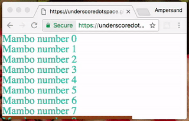

# Colin Tindle - mini portfolio

### Things I have made

_Currently live on Bower, albeit with Alpha status_

#### ng-cleantoast [:link:](github.com/underscoredotspace/ng-cleantoast)
A light, simple and fast toast component for Angular 1.x. Simple toast service for Angular 1.x. Most toast services are built on sending $emit messages via $rootScope. This never felt right to me, so this design keeps all data within the service and it's related directives. 

#### ng-isvisible [:link:](github.com/underscoredotspace/ng-isvisible)
Angular 1.x component to detect when DOM elements move in or out of view. Currently using $broadcast/$emit which makes me sad. 

